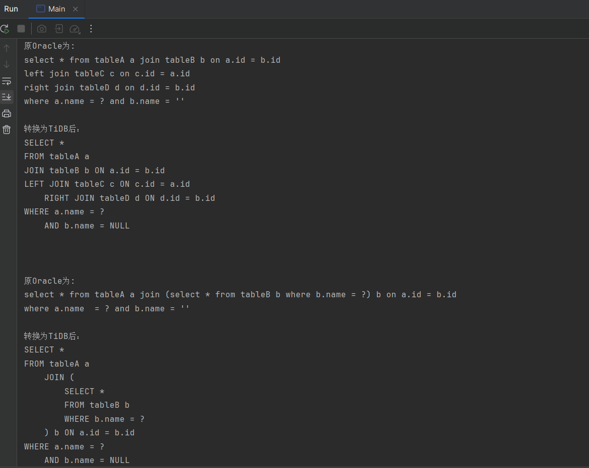

# 无忧SQL转换
（Don't Worry, Be Happy）

## 简介

这是一个SQL语法转换项目，可以帮助您实现从Oracle语法到TiDB语法的自动转换。  

本项目的语法转换依据为 [《Oracle 与 TiDB 函数和语法差异对照》](https://docs.pingcap.com/zh/tidb/stable/oracle-functions-to-tidb#oracle-%E4%B8%8E-tidb-%E5%87%BD%E6%95%B0%E5%92%8C%E8%AF%AD%E6%B3%95%E5%B7%AE%E5%BC%82%E5%AF%B9%E7%85%A7)  
目前支持的函数和语法可以从单元测试中查看。

## 项目地址
本项目的最新版本可以在 [GitHub](https://github.com/Zt-826/dont_worry_sql_convert) 上获取。

## 使用教程
将需要转化的Oracle语法的SQL复制到 **src/main/resources/sql_cases.txt** 中即可，多个SQL之间请使用空行分隔；  
然后运行 Main.java 中的 main 方法，即可在控制台看到转换后的TiDB语法的SQL。

